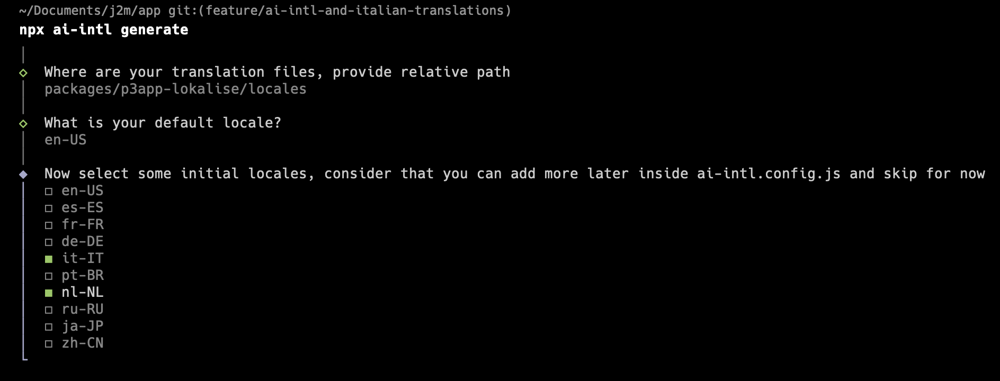

<div align="center">
  <div>
    
    <h1 align="center">AI-Intl</h1>
  </div>
	<p>A CLI that manage your translations for you with AI 🚀</p>
	<a href="https://www.npmjs.com/package/ai-intl"></a>
</div>

---

## Setup

> Please note that this project is currently under active development, so while it may not work 100% at this time, we are working diligently to improve it. Thank you for your patience and understanding.

1. Install ai-intl:

   ```sh
   npm install -g ai-intl
   ```

2. Retrieve your API key from [OpenAI](https://platform.openai.com/account/api-keys)

   > Note: If you haven't already, you'll have to create an account and set up billing.

3. Set the key so aicommits can use it:

   ```sh
   ai-intl config set OPENAI_KEY=<your token>
   ```

4. Generate the config file:

   ```sh
   ai-intl generate
   ```

   

5. You can now open _ai-intl.config.json_ and personalize your translations.

6. _Optional_ if you want to run ai-intl pre-commit set up the hook.

   ```sh
   ai-intl hook install
   ```

   If you are using husky add <code>npx ai-intl</code> to the pre-commit hook.

## What is all about?

Say goodbye to the complexities of internationalization with our AI-powered CLI application. This cutting-edge technology automates the process of translating and adapting your website for different cultures and languages, saving you time and effort.

## How it works

- CLI that generate for you translations on demand. Run <code>ai-intl translate</code> and it will translate the content for you.
- If enabled, the pre-commit hook 🚀 will check for translation changes in your default locale and adapt all other translations for each pull request.

## Advantages

Once you have finished your development, you no longer have to worry about translating the content. AI will take care of it for you.

## Future tasks

- Add support for conventional commits as a flag that users can enable
- Add support for diffs greater than 200 lines by grabbing the diff per file, optional flag
- Add ability to specify a commit message from inside aicommit if user doesn't like generated one
- Solve latency issue (use a githook to asynchronously run gpt3 call on every git add, store the result in a temp file or in the .git folder). Put behind a flag
- Use gpt-3-tokenizer instead of hard limit on characters as a more accurate model
- Play around with prompt to produce optimal result
- Add opt-in emoji flag to preface commits with an emoji, use [this](https://gitmoji.dev) as a guide
- Add opt-in languages flag where it returns the commit in different languages
- Add automated github releases using [this action](https://github.com/manovotny/github-releases-for-automated-package-publishing-action)
- Build landing page for the 2.0 launch

### A [jobtome-project](https://us.p3.jobtome.com/)

### Maintainers

- **Erik Olivero**: [@ekolivero](https://github.com/erik18xk)
